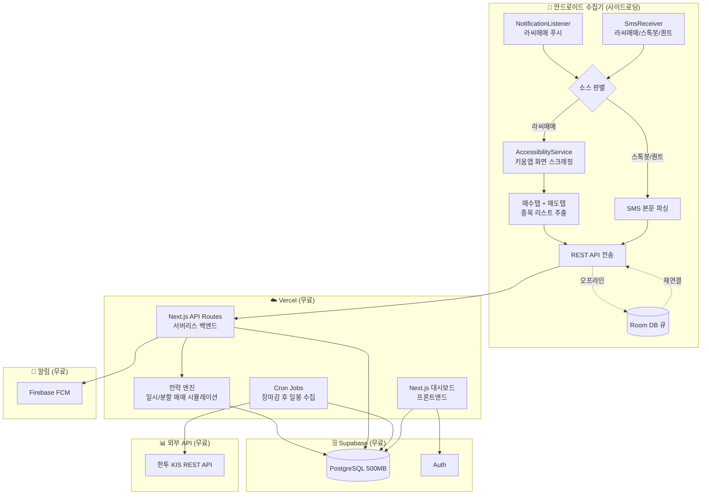

# AI 매매신호 분석 플랫폼 — 구현 계획 (v3)

> **목표**: 키움증권 AI 서비스 3종(라씨매매/스톡봇/퀀트)의 신호를 자동 수집하여
> 일시/분할 매매 전략별 성과를 비교 분석하는 개인용 대시보드

---

## 0. 실현 가능성 검토

### 핵심 리스크 분석

| 구성요소 | 리스크 | 수준 | 대응 |
| --- | --- | --- | --- |
| **AccessibilityService (라씨매매 화면 스크래핑)** | 키움앱 UI 변경 시 파서 깨짐, Android 정책 제약 | **높음** | 사이드로딩 전용, UI 요소 다중 탐색 전략, 폴백으로 SMS 데이터만 사용 |
| **SMS 수신 (BroadcastReceiver)** | Android 10+ SMS 권한 제한, Play Store 배포 불가 | **중간** | 사이드로딩(APK 직접 설치)으로 우회, RECEIVE_SMS 수동 허용 |
| **Supabase 무료 7일 비활성 중지** | DB 접근 없으면 자동 pause | **낮음** | 수집기가 매일 데이터 전송하므로 자동 해결 |
| **한투 KIS API Rate Limit** | 초당 20건 제한 | **낮음** | 장중 5분 간격 + 서버 캐싱 |

### AccessibilityService 상세 위험 요소

```
위험 1: 키움증권 앱 업데이트 시 UI 노드 구조 변경
  → 대응: resource-id + text + className 복합 탐색, 탐색 실패 시 알림

위험 2: 앱 로딩 지연 / 네트워크 오류 화면
  → 대응: 단계별 타임아웃(3초) + 최대 3회 재시도

위험 3: 스크롤이 필요한 긴 종목 리스트
  → 대응: AccessibilityNodeInfo.ACTION_SCROLL_FORWARD + 중복 종목코드 제거

위험 4: 앱이 백그라운드에서 강제 종료
  → 대응: Foreground Service로 수집기 보호, 실패 시 WorkManager 재시도

폴백 전략: AccessibilityService 실패 시 SMS 본문 데이터만 저장
  → SMS "펄어비스(263750) 보유중" 수준의 요약 데이터는 확보 가능
```

> [!WARNING]
> AccessibilityService 스크래핑은 **개인 사이드로딩 전용**입니다.
> Google Play Store에서는 접근성 서비스 남용으로 리젝됩니다.
> 키움증권 앱 업데이트마다 파서 점검이 필요합니다.

---

## 1. 시스템 아키텍처



> [!IMPORTANT]
> 키움증권의 3가지 AI 서비스 신호를 수집합니다:
>
> - **라씨매매신호** (종목 수 많음): 푸시/SMS가 **트리거** → AccessibilityService로 키움앱 화면 진입 → 매수/매도 탭 전체 종목 스크래핑 → **즐겨찾기한 종목만** 포트폴리오 추적
> - **스톡봇** (20개 이하): SMS 본문 직접 파싱 (추천주 + 매수가/목표가/손절가) → 전 종목 포트폴리오 추적
> - **퀀트** (20개 이하): SMS 본문 직접 파싱 (매수예고/매도완료 + AI상승확률) → 전 종목 포트폴리오 추적
>
> 각 AI별로 **일시매매**(한번에 전량)와 **분할매매**(3회 분할) 전략을 동시 시뮬레이션하여 성과를 비교합니다.
> 라씨매매는 신호 종목이 많으므로 **즐겨찾기** 기능으로 관심 종목만 선별하여 전략/포트폴리오에 반영합니다.

---

## 2. 기술 스택 & 비용

| 구성요소 | 서비스 | 무료 한도 | 월 비용 |
| --- | --- | --- | --- |
| **백엔드 + 프론트** | Vercel (Hobby) | 서버리스 함수 100GB-hrs, Cron 2개 | **$0** |
| **DB** | Supabase PostgreSQL | 500MB, 무제한 API 호출 | **$0** |
| **인증** | Supabase Auth | 50,000 MAU | **$0** |
| **주식 데이터** | 한투 KIS REST API | 무료 (계좌 필요) | **$0** |
| **푸시 알림** | Firebase FCM | 무제한 | **$0** |
| | | **합계** | **$0/월** |

> [!NOTE]
> **한투 KIS API**: 한국투자증권 계좌 개설(비대면 무료) 후 API Key 발급.
> 국내 주식 현재가/일봉 무료 조회. 초당 20건 제한.

---

## 3. 포트폴리오 & 전략 구조

### 3.1 전략 체계 개요

각 AI 소스의 신호가 들어오면, **일시매매**와 **분할매매** 두 가지 전략을 동시에 시뮬레이션합니다.

> [!NOTE]
> **라씨매매는 종목 수가 많습니다** (하루 20건 이상 신호 발생 가능).
> 모든 종목을 포트폴리오에 넣으면 과도하므로, **즐겨찾기한 종목만** 전략/포트폴리오에 반영합니다.
> 스톡봇/퀀트는 20개 이하로 전 종목을 자동 추적합니다.

```
데이터 흐름 & 포트폴리오 진입 조건:

[라씨매매] 신호 수집 (전체) → signals 테이블 저장 (전체)
  → ⭐ 즐겨찾기 종목인가? → YES → 전략 엔진 (일시/분할 매매)
                         → NO  → 신호 기록만 (포트폴리오 미반영, 대시보드에서 열람 가능)

[스톡봇]   신호 수집 → signals 저장 → 전략 엔진 (일시/분할 매매) — 전 종목 자동

[퀀트]     신호 수집 → signals 저장 → 전략 엔진 (일시/분할 매매) — 전 종목 자동
```

```
포트폴리오 구조:
┌─────────────────────────────────────────────────────────────┐
│  📊 통합 포트폴리오 (3개 AI 합산)                             │
│  ├── 일시매매 합산 성과                                       │
│  └── 분할매매 합산 성과                                       │
├─────────────────────────────────────────────────────────────┤
│  🔴 라씨매매 포트폴리오 (⭐ 즐겨찾기 종목만 추적)               │
│  ├── 일시매수/매도: 신호 즉시 전량 매수 → 매도 신호 시 전량 매도  │
│  ├── 분할매수/매도: 3회 분할매수 → 매도 신호 시 3회 분할매도     │
│  └── 즐겨찾기 관리: 종목 추가/제거, 신호 발생 시 알림 설정       │
├─────────────────────────────────────────────────────────────┤
│  🟢 스톡봇 포트폴리오 (전 종목 자동 추적, ~20개 이하)           │
│  ├── 일시매수/매도: 추천가에 전량 매수 → 목표가/손절가 전량 매도  │
│  └── 분할매수/매도: 매수가 범위에서 3회 분할매수 → 분할매도      │
├─────────────────────────────────────────────────────────────┤
│  🔵 퀀트 포트폴리오 (전 종목 자동 추적, ~20개 이하)             │
│  ├── 일시매수/매도: 15시가 전량 매수 → 매도완료 신호 시 전량 매도 │
│  └── 분할매수/매도: 매수예고 후 3일 분할매수 → 분할매도         │
└─────────────────────────────────────────────────────────────┘
```

### 3.2 일시매매 vs 분할매매 전략 상세

#### 일시매수/매도 전략

| AI 소스 | 매수 시점 | 매수 방식 | 매도 시점 | 매도 방식 |
| --- | --- | --- | --- | --- |
| **라씨매매** | 매수 신호 발생 즉시 | 신호 가격에 전량 1회 매수 | 매도 신호 발생 즉시 | 신호 가격에 전량 1회 매도 |
| **스톡봇** | 추천 SMS 수신 즉시 | 추천가에 전량 1회 매수 | 목표가/손절가 도달 시 | 도달 가격에 전량 1회 매도 |
| **퀀트** | 매수예고 당일 15시 | 15시 종가에 전량 1회 매수 | 매도완료 SMS 수신 시 | SMS 매도가에 전량 1회 매도 |

#### 분할매수/매도 전략

| AI 소스 | 매수 방식 | 매도 방식 | 분할 기준 |
| --- | --- | --- | --- |
| **라씨매매** | 매수 신호가에 1/3 → 다음날 시가에 1/3 → 그 다음날 시가에 1/3 | 매도 신호가에 1/3 → 다음날 시가에 1/3 → 그 다음날 시가에 1/3 | 3일에 걸쳐 균등 분할 |
| **스톡봇** | 매수가범위 하단에 1/3 → 중간에 1/3 → 상단에 1/3 | 목표가 90%에 1/3 → 목표가에 1/3 → 목표가 미도달 시 손절가에 잔량 | 매수가 범위 3등분 |
| **퀀트** | 매수예고일 15시에 1/3 → D+1 시가에 1/3 → D+2 시가에 1/3 | 매도완료가 기준 -2%에 1/3 → 매도가에 1/3 → +2%에 1/3 | 3일에 걸쳐 균등 분할 |

### 3.3 수익률 계산 방식

```
[일시매매 수익률]
  수익률 = (매도가 - 매수가) / 매수가 × 100%

[분할매매 수익률]
  평균매수가 = Σ(분할매수가 × 수량) / 총수량
  평균매도가 = Σ(분할매도가 × 수량) / 총수량
  수익률 = (평균매도가 - 평균매수가) / 평균매수가 × 100%

[포트폴리오 수익률]
  일간 수익률 = (당일 총평가액 - 전일 총평가액) / 전일 총평가액 × 100%
  누적 수익률 = (현재 총평가액 - 초기 투자금) / 초기 투자금 × 100%
```

### 3.4 포트폴리오 초기 설정

| 항목 | 값 | 비고 |
| --- | --- | --- |
| AI별 초기 투자금 | 각 10,000,000원 | 라씨/스톡봇/퀀트 각각 |
| 전략별 배분 | AI별 투자금의 50%씩 | 일시 5,000,000원 + 분할 5,000,000원 |
| 종목당 최대 비중 | 20% | 1,000,000원 이하 |
| 통합 포트폴리오 | 30,000,000원 | 3개 AI × 10,000,000원 합산 집계 |

---

## 4. 모듈별 상세 설계

### 모듈 A: 안드로이드 수집기

| 항목 | 내용 |
| --- | --- |
| **언어** | Kotlin, 최소 SDK API 26 (Android 8.0) |
| **핵심 서비스** | `NotificationListenerService` + `SmsReceiver` + `AccessibilityService` |
| **HTTP** | Retrofit2 + OkHttp |
| **로컬 큐** | Room DB (오프라인 큐잉) |
| **DI** | Hilt |
| **백그라운드** | Foreground Service (상시 실행) + WorkManager (재시도) |
| **배포** | APK 사이드로딩 (Play Store 배포 불가) |

#### 수집 대상 3가지 소스

| 소스 | 트리거 | 데이터 수집 방식 | 파싱 대상 |
| --- | --- | --- | --- |
| **라씨매매신호** | 앱 푸시 or SMS (`[키움][라씨매매신호]`) | 1단계: AccessibilityService로 키움앱 화면 스크래핑 / 2단계(폴백): SMS 본문 파싱 | 종목명, 종목코드, 가격, 시간그룹, 매수/매도 구분 |
| **스톡봇** | SMS (`[키움] 스톡봇`) | SMS 본문 직접 파싱 | 종목명, 추천가, 매수가범위, 목표가, 손절가, 투자포인트 |
| **퀀트** | SMS (`[키움]퀀트`) | SMS 본문 직접 파싱 | 종목명, 종목코드, 매수/매도, AI상승확률, 주가매력도, 수익률, 전략그룹 |

#### 데이터 흐름

```
[라씨매매 — 1단계: 화면 스크래핑]
  트리거: SMS "[키움][라씨매매신호]" 수신 or 앱 푸시 감지
  → Intent로 키움증권 앱(com.kiwoom.smartopen) 실행
  → AccessibilityService가 UI 트리 탐색:
     1) 하단 탭 "라씨매매신호" 찾기 → 클릭 (이미 해당 화면이면 스킵)
     2) 상단 요약 영역에서 "오늘 발생한 AI매매신호 N건" 파싱
     3) "매수" 탭 클릭 → 종목 카드 리스트 스크롤하며 추출
        - 시간 그룹: "22분전", "09:20" 등
        - 종목 정보: "TIGER 미국달…(456610) 63,565원"
     4) "매도" 탭 클릭 → 동일하게 추출
     5) 스크롤 끝(새 항목 없음) 감지 시 종료
  → JSON 변환 → REST API POST
  → 실패 시 2단계(폴백)으로 전환

[라씨매매 — 2단계: SMS 폴백]
  SMS 본문에서 직접 파싱 (제한된 데이터):
  → "펄어비스(263750) 보유중, 한화시스템(272210) 오늘 매도" → JSON
  → 종목코드 + 상태만 추출 (가격 정보 없음)
  → is_fallback: true 플래그 포함하여 전송

[스톡봇] SMS "[키움] 스톡봇 추천주" 수신
  → 정규식으로 본문 파싱:
     종목명: "▷ 종목명: (.+)"
     추천가: "추천가: ([0-9,]+)원"
     매수가범위: "매수가 범위: ([0-9,]+)원 ~ ([0-9,]+)원"
     목표가: "목표가: ([0-9,]+)원"
     손절가: "손절가: ([0-9,]+)원"
     투자포인트: "투자포인트: (.+)"
  → JSON 변환 → REST API POST

[퀀트 - 매수예고] SMS "[키움]퀀트 - 매수예고신호" 수신
  → 전략그룹: "◆(성장추구|가치추구)"
  → 종목: "◇(.+)\((\d{6})\)"
  → AI확률: "AI상승확률([0-9.]+)/주가매력도([0-9.]+)"
  → 점수: "성장성([0-9.]+)/안정성([0-9.]+)/수익성([0-9.]+)"
  → JSON 변환 → REST API POST

[퀀트 - 매도완료] SMS "[키움]퀀트 - 매도완료" 수신
  → 전략그룹: "◆(성장추구|가치추구)"
  → 종목: "◇(.+)\((\d{6})\)"
  → 매도가: "매도가 ([0-9,]+)원"
  → 수익률: "수익률 ([+-]?[0-9.]+)%"
  → JSON 변환 → REST API POST

공통: → REST API POST → Vercel API Route → Supabase 저장
      → 오프라인 시 Room DB 큐잉 → 재연결 시 일괄 전송
```

#### AccessibilityService 구현 상세

```kotlin
// 핵심 구현 전략
class KiwoomScraperService : AccessibilityService() {

    // UI 요소 탐색 우선순위 (앱 업데이트 대응)
    // 1순위: resource-id (가장 안정적이나 난독화될 수 있음)
    // 2순위: text 내용 매칭 ("매수", "매도", 종목코드 패턴)
    // 3순위: className + 위치 기반 휴리스틱

    // 단계별 상태 머신
    enum class ScrapingState {
        IDLE,                    // 대기
        LAUNCHING_APP,           // 키움앱 실행 중
        NAVIGATING_TO_LASSI,     // 라씨매매신호 탭 이동 중
        SCRAPING_BUY_TAB,        // 매수 탭 스크래핑 중
        SCRAPING_SELL_TAB,       // 매도 탭 스크래핑 중
        COMPLETED,               // 완료
        FAILED                   // 실패 → 폴백
    }

    // 각 단계별 타임아웃: 5초
    // 최대 재시도: 2회
    // 전체 타임아웃: 60초 (스크롤 포함)
}
```

```
필요한 Android 권한:
- RECEIVE_SMS (SMS 수신)
- READ_SMS (SMS 본문 읽기)
- BIND_NOTIFICATION_LISTENER_SERVICE (푸시 감지)
- BIND_ACCESSIBILITY_SERVICE (화면 스크래핑)
- FOREGROUND_SERVICE (상시 실행)
- INTERNET (API 통신)
- RECEIVE_BOOT_COMPLETED (부팅 시 자동 시작)
```

#### 전송 포맷 — 라씨매매신호 (화면 스크래핑)

```json
{
  "signals": [
    {
      "timestamp": "2026-03-09T09:20:00+09:00",
      "symbol": "456610",
      "name": "TIGER 미국달러단기채권액티브",
      "signal_type": "BUY",
      "signal_price": 63565,
      "source": "lassi",
      "time_group": "09:20",
      "is_fallback": false
    },
    {
      "timestamp": "2026-03-09T10:01:00+09:00",
      "symbol": "025880",
      "name": "케이씨피드",
      "signal_type": "SELL",
      "signal_price": 3225,
      "source": "lassi",
      "time_group": "2분전",
      "is_fallback": false
    }
  ],
  "summary": {
    "total_signals": 22,
    "buy_count": 5,
    "sell_count": 17
  },
  "device_id": "collector-001",
  "batch_id": "uuid-v4"
}
```

#### 전송 포맷 — 라씨매매신호 (SMS 폴백)

```json
{
  "signals": [
    {
      "timestamp": "2026-03-09T09:15:00+09:00",
      "symbol": "263750",
      "name": "펄어비스",
      "signal_type": "HOLD",
      "signal_price": null,
      "source": "lassi",
      "is_fallback": true
    }
  ],
  "device_id": "collector-001",
  "batch_id": "uuid-v4"
}
```

#### 전송 포맷 — 스톡봇

```json
{
  "signals": [
    {
      "timestamp": "2026-03-09T09:00:00+09:00",
      "name": "하나마이크론",
      "signal_type": "BUY",
      "source": "stockbot",
      "raw_data": {
        "recommend_price": 34500,
        "buy_range_low": 33900,
        "buy_range_high": 35000,
        "target_price": 38700,
        "stop_loss_price": 31700,
        "investment_point": "실적 고성장+외국인&기관 동반 매수",
        "company_overview": "반도체 패키징 및 테스트 사업자"
      }
    }
  ],
  "device_id": "collector-001",
  "batch_id": "uuid-v4"
}
```

#### 전송 포맷 — 퀀트 (매수예고)

```json
{
  "signals": [
    {
      "timestamp": "2026-03-09T14:30:00+09:00",
      "symbol": "001390",
      "name": "KG케미칼",
      "signal_type": "BUY_FORECAST",
      "source": "quant",
      "raw_data": {
        "strategy_group": "성장추구",
        "ai_rise_prob": 89.29,
        "price_attractiveness": 99.96,
        "growth_score": 57.3,
        "stability_score": 74.3,
        "profitability_score": 61.3,
        "theme_info": "(03/06)2차전지(소재/부품) 테마 평균 +3.22% 상승"
      }
    }
  ],
  "device_id": "collector-001",
  "batch_id": "uuid-v4"
}
```

#### 전송 포맷 — 퀀트 (매도완료)

```json
{
  "signals": [
    {
      "timestamp": "2026-03-09T15:30:00+09:00",
      "symbol": "037460",
      "name": "삼지전자",
      "signal_type": "SELL_COMPLETE",
      "source": "quant",
      "raw_data": {
        "strategy_group": "성장추구",
        "sell_price": 19310,
        "return_pct": -12.43
      }
    }
  ],
  "device_id": "collector-001",
  "batch_id": "uuid-v4"
}
```

---

### 모듈 B: Vercel 백엔드 (Next.js API Routes)

| 항목 | 내용 |
| --- | --- |
| **런타임** | Next.js API Routes (Node.js 서버리스) |
| **DB 접근** | Supabase JS Client (`@supabase/supabase-js`) |
| **스케줄러** | Vercel Cron Jobs (무료 2개: 장마감 일봉 수집 + 일간 통계 집계) |
| **가격 데이터** | 한투 KIS REST API |
| **푸시** | `firebase-admin` SDK → FCM |
| **배포** | Vercel (Git push 자동 배포) |

> [!NOTE]
> **왜 Next.js API Routes인가?**
> Vercel에서 프론트 + 백엔드를 하나의 프로젝트로 관리 가능하고,
> 간단한 JS 연산으로 충분한 수준의 통계 집계이며,
> 복잡한 분석이 필요하면 Supabase SQL Function으로 처리합니다.

#### API 설계

```
# 신호 수집 (수집기 → 서버)
POST   /api/v1/signals/batch             # 3개 소스 통합 수신
  - Header: X-Device-Key (API Key 인증)

# 신호 조회
GET    /api/v1/signals                    # 목록 (필터: source, symbol, date, signal_type)
GET    /api/v1/signals/today              # 오늘의 신호 (소스별 그룹)

# 대시보드
GET    /api/v1/dashboard/overview         # 종합 요약 (통합 + AI별 성과)
GET    /api/v1/dashboard/ranking          # 종목별 신호 빈도/성과 랭킹

# 포트폴리오
GET    /api/v1/portfolio/combined         # 통합 포트폴리오 (3개 AI 합산)
GET    /api/v1/portfolio/combined/history # 통합 일별 추이
GET    /api/v1/portfolio/:source          # AI별 포트폴리오 (source: lassi/stockbot/quant)
GET    /api/v1/portfolio/:source/history  # AI별 일별 추이
  - Query: execution_type=lump|split     # 일시/분할 필터

# 전략 성과 비교
GET    /api/v1/performance/compare        # 일시 vs 분할 전략 성과 비교
  - Query: source (선택), period (7d/30d/90d/all)
GET    /api/v1/performance/by-source      # AI 소스별 성과 비교
GET    /api/v1/performance/trades         # 거래 내역 (필터: source, execution_type)

# 종목
GET    /api/v1/stocks/:symbol             # 종목 상세 + 신호 이력
GET    /api/v1/stocks/:symbol/chart       # 일봉 차트 데이터

# 즐겨찾기 (라씨매매 종목 필터링)
GET    /api/v1/favorites                  # 즐겨찾기 종목 목록
POST   /api/v1/favorites                  # 즐겨찾기 추가 (symbol, name)
DELETE /api/v1/favorites/:symbol          # 즐겨찾기 제거
GET    /api/v1/favorites/candidates       # 즐겨찾기 후보: 최근 라씨매매 신호 종목 중 미등록 목록

# 알림
POST   /api/v1/notifications/register     # FCM 토큰 등록
PUT    /api/v1/notifications/rules        # 알림 규칙 설정

# 수집기 상태
GET    /api/v1/collector/status           # 수집기 연결 상태, 최근 수신 시각
```

#### Vercel Cron Jobs (무료 2개)

| Cron | 일정 | 작업 |
| --- | --- | --- |
| **일봉 수집 + 분할매매 체크** | 평일 16:00 KST | 당일 신호 종목 일봉 수집 + 분할매수/매도 예약 건 체크 및 실행 |
| **일간 통계 + 스냅샷** | 평일 18:00 KST | 포트폴리오 스냅샷 저장 + 소스별/전략별 수익률 집계 |

#### DB 스키마

```sql
-- ============================================
-- 핵심: 신호 수집
-- ============================================

CREATE TABLE signals (
  id            UUID PRIMARY KEY DEFAULT gen_random_uuid(),
  created_at    TIMESTAMPTZ DEFAULT now(),
  timestamp     TIMESTAMPTZ NOT NULL,
  symbol        VARCHAR(10),
  name          VARCHAR(100) NOT NULL,
  signal_type   VARCHAR(20) NOT NULL,    -- BUY/SELL/HOLD/BUY_FORECAST/SELL_COMPLETE
  source        VARCHAR(20) NOT NULL,    -- lassi/stockbot/quant
  batch_id      UUID,
  is_fallback   BOOLEAN DEFAULT false,
  raw_data      JSONB,
  device_id     VARCHAR(50)
);

CREATE INDEX idx_signals_source_date ON signals(source, timestamp);
CREATE INDEX idx_signals_symbol ON signals(symbol);

-- 일봉 가격 데이터
CREATE TABLE daily_prices (
  symbol        VARCHAR(10) NOT NULL,
  date          DATE NOT NULL,
  open          INTEGER,
  high          INTEGER,
  low           INTEGER,
  close         INTEGER NOT NULL,
  volume        BIGINT,
  PRIMARY KEY (symbol, date)
);

-- 종목 정보 캐시
CREATE TABLE stock_info (
  symbol        VARCHAR(10) PRIMARY KEY,
  name          VARCHAR(100) NOT NULL,
  sector        VARCHAR(50),
  market        VARCHAR(10),             -- KOSPI/KOSDAQ
  updated_at    TIMESTAMPTZ DEFAULT now()
);

-- ============================================
-- 즐겨찾기 (라씨매매 종목 필터링)
-- ============================================

-- 라씨매매 즐겨찾기: 이 테이블에 있는 종목만 전략/포트폴리오에 반영
-- 스톡봇/퀀트는 전 종목 자동 추적이므로 즐겨찾기 불필요
CREATE TABLE favorite_stocks (
  symbol        VARCHAR(10) PRIMARY KEY,
  name          VARCHAR(100) NOT NULL,
  added_at      TIMESTAMPTZ DEFAULT now(),
  note          TEXT                         -- 관심 사유 메모
);

-- ============================================
-- 전략 & 포트폴리오 (일시/분할 구분)
-- ============================================

-- 가상 거래 기록
CREATE TABLE virtual_trades (
  id              UUID PRIMARY KEY DEFAULT gen_random_uuid(),
  created_at      TIMESTAMPTZ DEFAULT now(),
  source          VARCHAR(20) NOT NULL,    -- lassi/stockbot/quant
  execution_type  VARCHAR(10) NOT NULL,    -- lump(일시) / split(분할)
  symbol          VARCHAR(10) NOT NULL,
  name            VARCHAR(100),
  side            VARCHAR(4) NOT NULL,     -- BUY/SELL
  price           INTEGER NOT NULL,
  quantity        INTEGER NOT NULL,
  split_seq       INTEGER,                 -- 분할매매 순번 (1,2,3), 일시는 null
  signal_id       UUID REFERENCES signals(id),
  trade_group_id  UUID,                    -- 동일 신호의 분할 거래 묶음 ID
  note            TEXT
);

CREATE INDEX idx_trades_source_exec ON virtual_trades(source, execution_type);
CREATE INDEX idx_trades_group ON virtual_trades(trade_group_id);

-- 분할매매 예약 (Cron에서 실행)
CREATE TABLE split_trade_schedule (
  id              UUID PRIMARY KEY DEFAULT gen_random_uuid(),
  trade_group_id  UUID NOT NULL,
  source          VARCHAR(20) NOT NULL,
  symbol          VARCHAR(10) NOT NULL,
  side            VARCHAR(4) NOT NULL,
  quantity        INTEGER NOT NULL,
  scheduled_date  DATE NOT NULL,
  split_seq       INTEGER NOT NULL,        -- 2회차, 3회차
  status          VARCHAR(10) DEFAULT 'pending',  -- pending/executed/cancelled
  executed_price  INTEGER,
  executed_at     TIMESTAMPTZ,
  signal_id       UUID REFERENCES signals(id)
);

CREATE INDEX idx_schedule_date ON split_trade_schedule(scheduled_date, status);

-- 포트폴리오 일별 스냅샷
CREATE TABLE portfolio_snapshots (
  id              UUID PRIMARY KEY DEFAULT gen_random_uuid(),
  date            DATE NOT NULL,
  source          VARCHAR(20) NOT NULL,    -- lassi/stockbot/quant
  execution_type  VARCHAR(10) NOT NULL,    -- lump/split
  holdings        JSONB NOT NULL,          -- [{"symbol":"028670","qty":10,"avg_price":4800}]
  cash            BIGINT NOT NULL,
  total_value     BIGINT NOT NULL,
  daily_return_pct NUMERIC(8,4),
  cumulative_return_pct NUMERIC(8,4),
  UNIQUE(date, source, execution_type)
);

-- 통합 포트폴리오 스냅샷 (3개 AI 합산, 뷰로 처리 가능하지만 성능상 테이블)
CREATE TABLE combined_portfolio_snapshots (
  id              UUID PRIMARY KEY DEFAULT gen_random_uuid(),
  date            DATE NOT NULL,
  execution_type  VARCHAR(10) NOT NULL,    -- lump/split
  total_value     BIGINT NOT NULL,         -- 3개 AI 합산
  daily_return_pct NUMERIC(8,4),
  cumulative_return_pct NUMERIC(8,4),
  breakdown       JSONB NOT NULL,          -- {"lassi":{"value":...},"stockbot":{"value":...},...}
  UNIQUE(date, execution_type)
);

-- ============================================
-- 분석 & 통계
-- ============================================

CREATE TABLE daily_signal_stats (
  id            UUID PRIMARY KEY DEFAULT gen_random_uuid(),
  date          DATE NOT NULL,
  source        VARCHAR(20) NOT NULL,
  execution_type VARCHAR(10) NOT NULL,     -- lump/split
  total_signals INTEGER,
  buy_count     INTEGER,
  sell_count    INTEGER,
  realized_trades INTEGER,                 -- 완결된 매수→매도 사이클 수
  hit_rate      NUMERIC(5,2),              -- 수익 거래 비율 %
  avg_return    NUMERIC(8,4),              -- 평균 수익률 %
  UNIQUE(date, source, execution_type)
);

-- ============================================
-- 알림 & 시스템
-- ============================================

CREATE TABLE fcm_tokens (
  id            UUID PRIMARY KEY DEFAULT gen_random_uuid(),
  token         TEXT NOT NULL UNIQUE,
  platform      VARCHAR(10),
  created_at    TIMESTAMPTZ DEFAULT now()
);

CREATE TABLE notification_rules (
  id            UUID PRIMARY KEY DEFAULT gen_random_uuid(),
  conditions    JSONB NOT NULL,
  active        BOOLEAN DEFAULT true,
  created_at    TIMESTAMPTZ DEFAULT now()
);

CREATE TABLE collector_heartbeats (
  id            UUID PRIMARY KEY DEFAULT gen_random_uuid(),
  device_id     VARCHAR(50) NOT NULL,
  timestamp     TIMESTAMPTZ DEFAULT now(),
  status        VARCHAR(20),
  last_signal   TIMESTAMPTZ,
  error_message TEXT
);
```

#### 전략 엔진 처리 흐름

```
신호 수신 시 전략 엔진 동작:

[1] 신호 → signals 테이블 저장 (모든 소스, 모든 종목)

[2] 전략 진입 판단:
    → 라씨매매: favorite_stocks 테이블에 해당 symbol 존재하는가?
      → YES → [3]으로 진행
      → NO  → 종료 (신호 기록만, 포트폴리오 미반영)
    → 스톡봇/퀀트: 무조건 [3]으로 진행 (전 종목 자동 추적)

[3] 일시매매(lump) 처리:
    → 즉시 virtual_trades에 전량 매수/매도 기록
    → 포트폴리오 반영

[4] 분할매매(split) 처리:
    → 1회차: 즉시 virtual_trades에 1/3 매수/매도 기록
    → 2회차: split_trade_schedule에 D+1 예약 등록
    → 3회차: split_trade_schedule에 D+2 예약 등록

[5] Cron (매일 16:00):
    → split_trade_schedule에서 today = scheduled_date인 건 조회
    → 해당 종목 현재가(일봉 종가) 조회
    → virtual_trades에 실행 기록
    → schedule status = 'executed' 업데이트

[6] Cron (매일 18:00):
    → 전 포트폴리오(6개) 스냅샷 생성
    → combined_portfolio_snapshots 생성 (3개 AI 합산)
    → daily_signal_stats 집계

즐겨찾기 변경 시:
  → 종목 추가: 과거 신호가 있으면 해당 시점부터 소급 반영할지 선택 가능
  → 종목 제거: 보유 중인 포지션은 현재가에 청산 처리 후 제거
```

#### 한투 KIS API 활용

| 용도 | API | 호출 시점 | 비고 |
| --- | --- | --- | --- |
| 현재가 조회 | 주식현재가 시세 | 신호 수신 시 | 스톡봇 종목코드 조회에도 사용 |
| 일봉 데이터 | 주식현재가 일자별 | Vercel Cron (평일 16:00) | 당일 신호 종목 + 분할매매 대상 종목 |
| 종목명 검색 | 상품기본조회 | 종목코드↔종목명 매핑 시 | stock_info 테이블 캐싱 |

---

### 모듈 C: Next.js 웹 프론트엔드

| 항목 | 내용 |
| --- | --- |
| **프레임워크** | Next.js 14 (App Router) |
| **언어** | TypeScript |
| **차트** | Lightweight Charts (TradingView 오픈소스) |
| **상태** | Zustand |
| **HTTP** | SWR |
| **스타일** | Tailwind CSS |
| **인증** | Supabase Auth UI |
| **배포** | Vercel (API Routes와 동일 프로젝트) |

#### 페이지 구성

| 페이지 | 경로 | Phase | 설명 |
| --- | --- | --- | --- |
| **메인 대시보드** | `/` | 1 | 통합 성과 요약, AI별 오늘 신호 수, 일시/분할 수익률 비교 카드 |
| **오늘의 신호** | `/signals` | 1 | 소스별 탭 (라씨/스톡봇/퀀트), 시간순 정렬, 라씨매매는 ⭐즐겨찾기 표시 |
| **신호 상세** | `/signals/[id]` | 1 | 신호 원본 데이터 + 해당 종목 차트 + 일시/분할 거래 결과 |
| **통합 포트폴리오** | `/portfolio` | 2 | 3개 AI 합산 현황, 일시/분할 탭 전환, 일별 추이 차트 |
| **라씨매매 포트폴리오** | `/portfolio/lassi` | 2 | ⭐즐겨찾기 종목만 추적, 일시/분할 성과 비교, 즐겨찾기 관리 패널 |
| **스톡봇 포트폴리오** | `/portfolio/stockbot` | 2 | 전 종목 자동 추적, 일시/분할 성과 비교, 목표가 도달 현황 |
| **퀀트 포트폴리오** | `/portfolio/quant` | 2 | 전 종목 자동 추적, 일시/분할 성과 비교, 성장추구/가치추구 그룹별 |
| **전략 성과 비교** | `/performance` | 2 | 일시 vs 분할 크로스 비교, AI별 비교, 기간별 필터 |
| **종목 상세** | `/stocks/[symbol]` | 2 | 캔들차트 + 신호 마커 오버레이 + AI별 거래 이력 |
| **수집기 상태** | `/collector` | 1 | 수집기 연결 상태, 최근 수신 로그, 스크래핑 성공률 |
| **설정** | `/settings` | 3 | 알림 규칙, 포트폴리오 초기 투자금 설정 |

#### 신호 페이지 와이어프레임 (라씨매매 탭)

```
┌──────────────────────────────────────────────────────┐
│  📡 오늘의 신호 (/signals)                             │
│                                                      │
│  [🔴 라씨매매(22)]  [🟢 스톡봇(1)]  [🔵 퀀트(2)]        │
│                                                      │
│  오늘 발생한 AI매매신호 22건  (매수 5 / 매도 17)        │
│                                                      │
│  [매수]  [매도]     [⭐ 즐겨찾기만 보기 ○]               │
│                                                      │
│  09:20  4종목                                        │
│  ┌──────────────────────────────────────────┐        │
│  │ ⭐ TIGER 미국달… 456610   63,565원  [BUY]  │        │
│  │    KODEX 미국달… 455030   12,820원  [BUY]  │        │
│  │    RISE 국채선물… 295020  58,480원  [BUY]  │        │
│  │    THE E&M       089230   1,380원  [BUY]  │        │
│  └──────────────────────────────────────────┘        │
│                                                      │
│  22분전  1종목                                        │
│  ┌──────────────────────────────────────────┐        │
│  │    PLUS 차이나항… 0128D0   8,195원  [BUY]  │        │
│  └──────────────────────────────────────────┘        │
│                                                      │
│  ⭐ = 즐겨찾기 종목 (클릭하여 추가/제거)                 │
│  즐겨찾기 종목만 포트폴리오에 반영됩니다                   │
└──────────────────────────────────────────────────────┘
```

#### 포트폴리오 페이지 와이어프레임

```
┌──────────────────────────────────────────────────────┐
│  📊 통합 포트폴리오 (/portfolio)                       │
│                                                      │
│  [일시매매]  [분할매매]    ← 탭 전환                    │
│                                                      │
│  총 평가액: 31,245,000원 (+4.15%)                     │
│  ┌──────────────────────────────────────────┐        │
│  │        일별 수익률 추이 차트 (꺾은선)       │        │
│  └──────────────────────────────────────────┘        │
│                                                      │
│  AI별 성과 카드:                                      │
│  ┌────────────┐ ┌────────────┐ ┌────────────┐       │
│  │ 🔴 라씨매매  │ │ 🟢 스톡봇   │ │ 🔵 퀀트     │       │
│  │ +5.2%      │ │ +3.1%      │ │ +4.0%      │       │
│  │ 10,520,000 │ │ 10,310,000 │ │ 10,400,000 │       │
│  └────────────┘ └────────────┘ └────────────┘       │
└──────────────────────────────────────────────────────┘

┌──────────────────────────────────────────────────────┐
│  🔴 라씨매매 포트폴리오 (/portfolio/lassi)             │
│                                                      │
│  ⭐ 즐겨찾기 관리 (상단 접이식 패널)                     │
│  ┌──────────────────────────────────────────┐        │
│  │ 현재 즐겨찾기: 팬오션, 펄어비스, 한화에어로 (+5)│        │
│  │                                          │        │
│  │ 오늘 새 신호 종목 (즐겨찾기 미등록):        │        │
│  │  케이씨피드(025880) [+ 추가]               │        │
│  │  성우전자(081580)   [+ 추가]               │        │
│  │  TIGER 미국AI(0102A0) [+ 추가]            │        │
│  └──────────────────────────────────────────┘        │
│                                                      │
│  ┌─────────────────────┬─────────────────────┐      │
│  │    일시매매           │    분할매매           │      │
│  │    +5.2% (520,000)   │    +6.1% (610,000)   │      │
│  │    보유 3종목         │    보유 3종목         │      │
│  │    완결 12건          │    완결 12건          │      │
│  │    적중률 66.7%       │    적중률 75.0%       │      │
│  └─────────────────────┴─────────────────────┘      │
│                                                      │
│  보유 종목 (즐겨찾기만):                                │
│  │ 종목   │ 일시 수익률 │ 분할 수익률 │ 평균단가 차이 │    │
│  │ 팬오션  │ +3.2%     │ +4.1%     │ -150원       │    │
│  │ 펄어비스│ -1.5%     │ -0.8%     │ -320원       │    │
│                                                      │
│  거래 내역 (최근):                                     │
│  │ 일시 │ 종목 │ 매수가 → 매도가 │ 수익률 │            │
│  │ 분할 │ 종목 │ 평균매수 → 평균매도 │ 수익률 │         │
└──────────────────────────────────────────────────────┘
```

---

## 5. 개발 로드맵

### Phase 1: 데이터 수집 MVP (4주)

> 목표: 3개 소스의 신호를 안정적으로 수집하고 웹에서 확인

| 주차 | 작업 | 산출물 |
| --- | --- | --- |
| 1주 | Supabase DB 스키마 배포 + Vercel Next.js 초기화 + 신호 수신 API | 신호 수신 API 동작 확인 (curl) |
| 2주 | 안드로이드 수집기 — SMS 파서(스톡봇+퀀트) + NotificationListener + Retrofit + Room 큐 | SMS → Supabase 저장 확인 |
| 3주 | 안드로이드 수집기 — AccessibilityService(라씨매매 화면 스크래핑) + 폴백 + 상태 머신 | 라씨매매 트리거 → 스크래핑 → DB 저장 확인 |
| 4주 | 웹 대시보드 MVP — 메인(`/`), 오늘의 신호(`/signals`), 수집기 상태(`/collector`) | 웹에서 수집된 신호 확인 가능 |

### Phase 2: 전략 엔진 & 포트폴리오 (4주)

> 목표: 일시/분할 매매 시뮬레이션 + 포트폴리오 추적 + 성과 시각화

| 주차 | 작업 | 산출물 |
| --- | --- | --- |
| 5주 | 한투 KIS API 연동 + Cron(일봉 수집) + 종목코드 매핑 | daily_prices 적재 확인 |
| 6주 | 전략 엔진 — 일시매매 로직 + 분할매매 로직 + split_trade_schedule + Cron 분할 실행 | 신호 수신 시 일시/분할 동시 기록 확인 |
| 7주 | 포트폴리오 스냅샷(6개 AI×전략) + 통합 스냅샷 + 일간 통계 집계 | portfolio_snapshots 일별 기록 확인 |
| 8주 | 웹 — 통합 포트폴리오(`/portfolio`) + AI별 포트폴리오(`/portfolio/:source`) + 성과 비교(`/performance`) | 일시/분할 비교 대시보드 |

### Phase 3: 고도화 (4주)

> 목표: 종목 상세, 알림, 안정성 강화

| 주차 | 작업 | 산출물 |
| --- | --- | --- |
| 9주 | 종목 상세(`/stocks/[symbol]`) — 캔들차트 + 신호 마커 + AI별 거래 이력 | 종목별 신호/거래 시각화 |
| 10주 | FCM 푸시 알림 + 알림 규칙 설정(`/settings`) | 조건부 푸시 알림 동작 |
| 11주 | AccessibilityService 안정성 강화 + 에러 리포팅 + 수집기 모니터링 고도화 | 스크래핑 성공률 95%+ |
| 12주 | 모바일 반응형 최적화 + E2E 테스트 + 버그 수정 | 안정적 운영 가능 상태 |

---

## 6. 프로젝트 구조

```
DashboardStock/
├── docs/                              # 기획 문서, SMS 예시
│
├── android-collector/                 # 📱 안드로이드 수집기 (사이드로딩)
│   ├── app/src/main/
│   │   ├── java/com/.../collector/
│   │   │   ├── service/
│   │   │   │   ├── SmsReceiver.kt
│   │   │   │   ├── NotificationListener.kt
│   │   │   │   ├── KiwoomAccessibility.kt
│   │   │   │   └── CollectorForeground.kt
│   │   │   ├── parser/
│   │   │   │   ├── LassiScreenParser.kt
│   │   │   │   ├── LassiSmsParser.kt
│   │   │   │   ├── StockbotSmsParser.kt
│   │   │   │   └── QuantSmsParser.kt
│   │   │   ├── api/
│   │   │   │   └── SignalApiClient.kt
│   │   │   ├── db/
│   │   │   │   ├── SignalQueueDao.kt
│   │   │   │   └── AppDatabase.kt
│   │   │   └── ui/
│   │   │       └── StatusActivity.kt
│   │   ├── res/xml/
│   │   │   └── accessibility_config.xml
│   │   └── AndroidManifest.xml
│   └── build.gradle.kts
│
├── web/                               # 🌐 Next.js (Vercel: 프론트+백엔드)
│   ├── src/
│   │   ├── app/
│   │   │   ├── api/v1/                # API Routes
│   │   │   │   ├── signals/
│   │   │   │   │   ├── batch/route.ts
│   │   │   │   │   └── route.ts
│   │   │   │   ├── dashboard/route.ts
│   │   │   │   ├── portfolio/
│   │   │   │   │   ├── combined/route.ts
│   │   │   │   │   └── [source]/route.ts
│   │   │   │   ├── performance/route.ts
│   │   │   │   ├── stocks/[symbol]/route.ts
│   │   │   │   ├── favorites/
│   │   │   │   │   ├── route.ts               # GET 목록 / POST 추가
│   │   │   │   │   ├── [symbol]/route.ts      # DELETE 제거
│   │   │   │   │   └── candidates/route.ts    # GET 즐겨찾기 후보
│   │   │   │   ├── notifications/route.ts
│   │   │   │   └── collector/status/route.ts
│   │   │   ├── (pages)/
│   │   │   │   ├── page.tsx               # 메인 대시보드
│   │   │   │   ├── signals/page.tsx
│   │   │   │   ├── signals/[id]/page.tsx
│   │   │   │   ├── portfolio/
│   │   │   │   │   ├── page.tsx           # 통합 포트폴리오
│   │   │   │   │   ├── lassi/page.tsx     # 라씨매매 포트폴리오
│   │   │   │   │   ├── stockbot/page.tsx  # 스톡봇 포트폴리오
│   │   │   │   │   └── quant/page.tsx     # 퀀트 포트폴리오
│   │   │   │   ├── performance/page.tsx
│   │   │   │   ├── stocks/[symbol]/page.tsx
│   │   │   │   ├── collector/page.tsx
│   │   │   │   └── settings/page.tsx
│   │   │   └── layout.tsx
│   │   ├── components/
│   │   │   ├── charts/                # Lightweight Charts 래퍼
│   │   │   ├── portfolio/             # 포트폴리오 카드, 비교 테이블
│   │   │   ├── signals/               # 신호 카드, 리스트
│   │   │   ├── dashboard/             # 대시보드 위젯
│   │   │   └── common/                # 공통 UI
│   │   ├── lib/
│   │   │   ├── supabase.ts
│   │   │   ├── kis-api.ts
│   │   │   ├── fcm.ts
│   │   │   └── strategy-engine/
│   │   │       ├── index.ts           # 엔진 진입점
│   │   │       ├── lump-strategy.ts   # 일시매매 로직
│   │   │       ├── split-strategy.ts  # 분할매매 로직
│   │   │       └── portfolio.ts       # 포트폴리오 계산
│   │   └── types/
│   ├── vercel.json
│   ├── tailwind.config.ts
│   ├── package.json
│   └── tsconfig.json
│
└── supabase/
    └── migrations/
        ├── 001_signals.sql
        ├── 002_daily_prices.sql
        ├── 003_favorite_stocks.sql
        ├── 004_virtual_trades.sql
        ├── 005_split_schedule.sql
        ├── 006_portfolio_snapshots.sql
        └── 007_notifications.sql
```

---

## 7. 운영 주의사항

| 제약 | 대응 |
| --- | --- |
| Supabase 7일 비활성 중지 | 수집기가 매일 데이터 전송하므로 자동 활성 유지 |
| Vercel 서버리스 콜드 스타트 (~1초) | 수집기 전송은 응답 속도 무관, 대시보드 체감 지연 미미 |
| Vercel Cron 무료 2개 제한 | 일봉+분할실행(16:00) / 통계+스냅샷(18:00) 2개로 통합 |
| 한투 KIS API 초당 20건 | 일봉 수집 시 종목당 순차 호출 + 500ms 딜레이 |
| AccessibilityService 키움앱 업데이트 | 수집기 상태 모니터링으로 스크래핑 실패 즉시 감지 → 파서 수정 |
| Android SMS 권한 | 사이드로딩 + 수동 권한 허용 필수 |
| 포트폴리오 스냅샷 6개(3AI × 2전략) | 매일 6행 + 통합 2행 = 8행/일, 연 ~2,000행으로 500MB 내 충분 |

---

## 8. 검증 계획

| 항목 | 방법 | 성공 기준 |
| --- | --- | --- |
| SMS 파서 (스톡봇) | SMS 예시 텍스트 → 파서 출력 비교 | 추천가/목표가/손절가 100% 일치 |
| SMS 파서 (퀀트) | SMS 예시 텍스트 → 파서 출력 비교 | AI확률/매도가/수익률 100% 일치 |
| 화면 스크래핑 (라씨) | 트리거 → 화면 캡처 vs 스크래핑 결과 대조 | 종목코드/가격 95%+ 일치 |
| 폴백 전환 | AccessibilityService 의도적 차단 → SMS 폴백 동작 | 폴백 자동 전환 + is_fallback=true |
| 오프라인 큐 | 비행기 모드 → 신호 수신 → 재연결 후 전송 | Room 큐잉 → 재전송 성공 |
| 한투 KIS API | 종목코드 현재가 조회 → 실제 시세 비교 | 오차 0원 |
| 일시매매 엔진 | 라씨매매 매수→매도 사이클 수동 계산 vs 엔진 | 수익률 계산 일치 |
| 분할매매 엔진 | 3회 분할매수 평균단가 수동 계산 vs 엔진 | 평균매수가/매도가 일치 |
| 분할 스케줄 | 분할 예약 등록 → Cron 실행 → 거래 기록 확인 | D+1, D+2 예약 건 정상 실행 |
| 포트폴리오 스냅샷 | 6개 포트폴리오 + 통합 스냅샷 일별 생성 확인 | 8행/일 정상 기록 |
| 일시 vs 분할 비교 | 동일 신호에 대해 두 전략 수익률 비교 표시 | 대시보드에서 병렬 비교 가능 |
| E2E | 수집기 → API → 일시/분할 처리 → 웹 대시보드 | 신호 발생 후 30초 내 웹 반영 |
| 수집기 상태 | 12시간 무중단 운영 테스트 | Foreground Service 유지, heartbeat 정상 |
